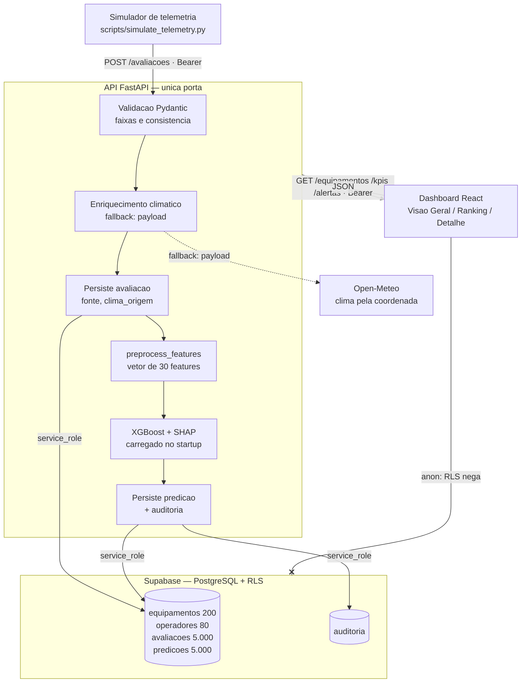
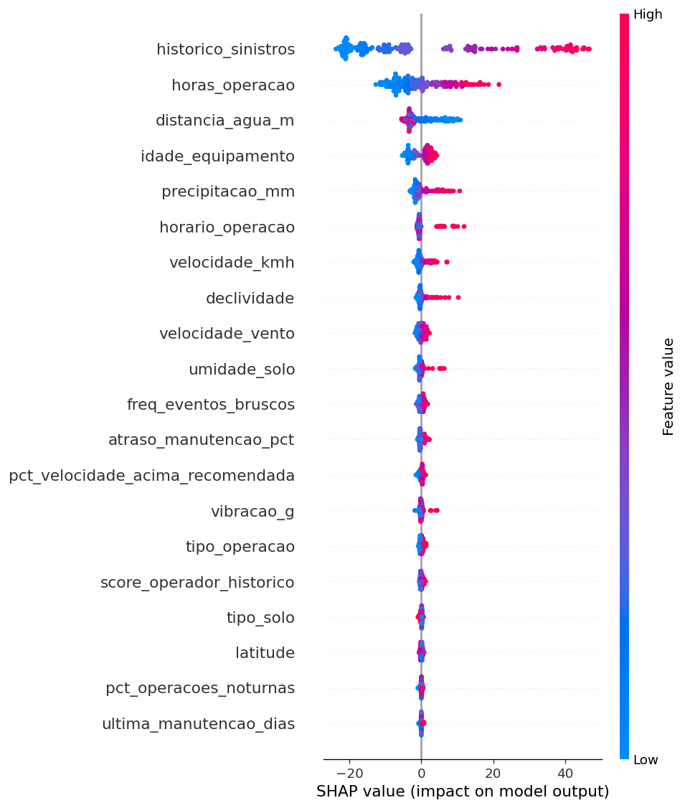
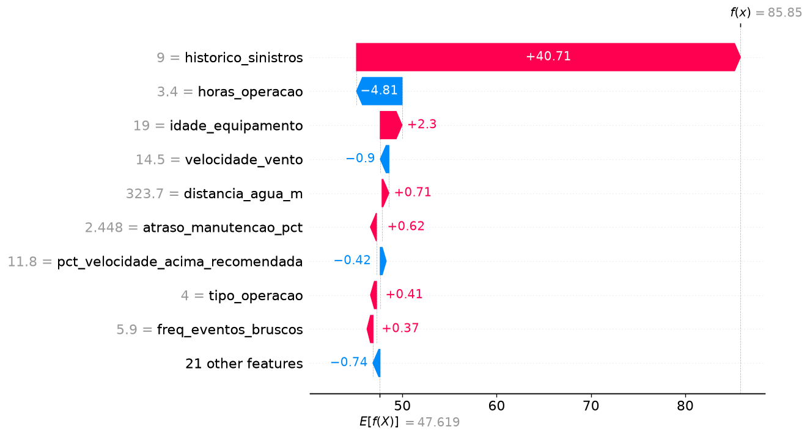

# Plataforma de Análise Preditiva de Riscos para Equipamentos Agrícolas

> **Challenge FIAP + Sompo Seguros**
> Entrega 3 — Integração: backend, ingestão validada, segurança e dashboard num fluxo de ponta a ponta

---

## Sumário

0. [Como Rodar o Projeto](#como-rodar-o-projeto)
1. [Descrição do Problema](#1-descrição-do-problema)
2. [Solução Proposta](#2-solução-proposta)
3. [Personas e Necessidades](#3-personas-e-necessidades)
4. [Estruturação dos Dados](#4-estruturação-dos-dados)
5. [Arquitetura da Solução](#5-arquitetura-da-solução)
6. [Modelo Preditivo](#6-modelo-preditivo)
7. [Evolução em Relação à Entrega Anterior](#7-evolução-em-relação-à-entrega-anterior)
8. [Planejamento das Próximas Etapas](#8-planejamento-das-próximas-etapas)
9. [Vídeo de Apresentação](#9-vídeo-de-apresentação)
10. [Equipe](#10-equipe)

---

## Como rodar o projeto

### Pré-requisitos

**Python 3.13.** Não use 3.14 — `xgboost`, `shap` e `numpy` ainda não publicam wheels para
essa versão e a instalação falha ou tenta compilar do zero.

**macOS — `libomp` (OpenMP).** O XGBoost depende do runtime OpenMP, que **não** vem pelo
`pip`. Sem ele, `import xgboost` falha com `libxgboost.dylib could not be loaded`:

```bash
brew install libomp
```

Linux e Windows já trazem o runtime equivalente (`libgomp` / `vcomp140`) e não precisam
deste passo.

### Primeira vez (setup completo)

O sistema tem duas metades que sobem em terminais separados: a **API** e o **dashboard**. A API
precisa estar no ar primeiro — sem ela o dashboard não tem de onde ler.

#### Terminal 1 — backend e API

```bash
# 1. Clonar o repositório
git clone https://github.com/Avila237/sompo.git
cd sompo

# 2. Criar ambiente virtual (Python 3.13)
python3.13 -m venv .venv

# 3. Ativar ambiente virtual
# Windows:
.venv\Scripts\activate
# Mac/Linux:
source .venv/bin/activate

# 4. Instalar dependências
pip install -r backend/requirements.txt

# 5. Gerar o dataset
python scripts/generate_dataset.py

# 6. Treinar o modelo (gera models/*.joblib, exigidos pelos testes e pela API)
python backend/ml/train.py

# 7. Rodar os testes
pytest tests/ -v

# 8. Subir a API
uvicorn backend.api.main:app --reload --port 8000
```

Com a API no ar, o Swagger navegável fica em **http://localhost:8000/docs** e a verificação de
saúde em **http://localhost:8000/health**.

#### Terminal 2 — dashboard

```bash
cd dashboard
cp .env.example .env.local     # VITE_API_BASE_URL=http://localhost:8000
npm install
npm run dev
# Abrir http://localhost:5175
```

O dashboard pede usuário e senha na abertura. As credenciais são trocadas por um JWT em
`POST /auth/token` — **nenhuma credencial fica no bundle nem em `.env.local`**, cuja única
variável é a base da API.

#### Configuração do backend (`.env` na raiz)

Use o [`.env.example`](.env.example) como base. O arquivo **não vai para o Git**. As credenciais de
demonstração (`DEMO_USERS`) e a `SUPABASE_SERVICE_ROLE_KEY` são combinadas fora do repositório.

> ⚠️ A `service_role` é superusuário do banco: só server-side, nunca no frontend, nunca versionada.

#### Notas de ambiente

Se `pytest` falhar reclamando de artefato de modelo ausente, o passo 6 não rodou — os `.joblib`
são git-ignored e precisam ser gerados localmente.

Se a tela de login acusar que não consegue falar com a API, confira se o Terminal 1 está de pé e
se a porta em `VITE_API_BASE_URL` bate com a do `uvicorn`.

### Atualizando (repositório já clonado)

```bash
git pull
source .venv/bin/activate        # Windows: .venv\Scripts\activate
pip install -r backend/requirements.txt
pytest tests/ -v
cd dashboard && npm install      # se package.json mudou
```

---

## 1. Descrição do Problema

O setor agrícola brasileiro opera com equipamentos de alto valor — colheitadeiras, tratores e implementos — expostos diariamente a riscos operacionais e ambientais como colisões com obstáculos no solo, tombamentos, atolamento por instabilidade do terreno, operação em proximidade de corpos d'água e danos durante o transporte entre propriedades.

Hoje, a gestão desses riscos é predominantemente reativa: o sinistro ocorre, gera custos elevados (reparo, indisponibilidade, perda total) e só então medidas corretivas são tomadas. A Sompo, que ocupa a 3ª posição no mercado brasileiro de seguros de máquinas e implementos agrícolas, enfrenta esse cenário diretamente — seus produtos Benfeitorias e Penhor Rural cobrem desde incêndio e furto até colisão de colheitadeiras e operação próxima de água.

O problema central é a **baixa previsibilidade desses eventos**. Faltam sistemas que correlacionem fatores ambientais (clima, tipo de solo, precipitação, proximidade de rios) com fatores operacionais (tipo de operação, velocidade, horário, histórico do equipamento) para antecipar situações de risco antes que o dano aconteça.

Os impactos diretos incluem: alto custo de sinistros para a seguradora, perdas financeiras e de produtividade para o produtor rural, e riscos à segurança dos operadores em campo.

---

## 2. Solução Proposta

A solução proposta é uma **plataforma de análise preditiva de riscos para equipamentos agrícolas**, composta por um aplicativo móvel como interface principal, um backend inteligente com modelo de machine learning e, opcionalmente, um dispositivo IoT embarcado (ESP32) para coleta de dados telemétricos em tempo real.

O sistema cruza dados ambientais (clima, precipitação, tipo de solo, proximidade de corpos d'água), operacionais (tipo de operação, vibração, temperatura, velocidade, histórico de uso) e geográficos (localização, relevo, hidrografia via shapefiles do IBGE) para gerar um **score de risco por equipamento e contexto operacional**.

A partir desse score, a plataforma entrega três tipos de saída:

- **Alertas preventivos** em tempo de decisão (antes ou durante a operação)
- **Recomendações práticas** de mitigação (ajuste de rota, adiamento, redução de velocidade)
- **Relatórios explicáveis** com os principais fatores que contribuem para o risco, utilizando SHAP para garantir transparência e auditabilidade

A arquitetura é **mobile-first** — o app funciona como ponto central de coleta (GPS, inputs do operador) e entrega (alertas, dashboard). O dispositivo IoT com ESP32 é um complemento opcional para equipamentos modernos, adicionando sensores de vibração (acelerômetro + giroscópio MPU-6050 GY-521) e temperatura (DS18B20) via Bluetooth Low Energy. Essa decisão garante **cobertura universal**: qualquer equipamento, inclusive máquinas mais antigas sem porta OBD, pode ser monitorado apenas com o celular do operador.

O valor entregue é a transformação de decisões reativas em ações preventivas, reduzindo frequência e severidade de sinistros para a Sompo e custos operacionais para o produtor rural.

A plataforma foi projetada para evoluir de uma solução de scoring ambiental e operacional para um ecossistema completo de gestão de risco: com perfil comportamental do operador incorporado ao modelo, manutenção preventiva comparada com os intervalos recomendados pelo fabricante, explicações contextuais geradas a partir de uma base de conhecimento técnico simulada (RAG), e Usage-Based Insurance para precificação dinâmica baseada em risco histórico real.

---

## 3. Personas e Necessidades

A solução atende três perspectivas principais, desdobradas em perfis específicos:

### 3.1 Sompo (Seguradora)

A Sompo precisa identificar e quantificar fatores que elevam a probabilidade de sinistros, gerar scores de risco por equipamento/região/tipo de operação para apoiar subscrição e precificação, e manter trilha de auditoria sobre os dados e modelos utilizados. As áreas internas beneficiadas incluem:

- **Subscrição:** score explicável para decisões técnicas e recomendações ao cliente.
- **Sinistros:** contexto ambiental e operacional do evento para triagem e aprendizado preventivo.
- **Gestão de risco:** visão agregada para orientar prevenção e reduzir frequência de sinistros.

### 3.2 Cliente Segurado (Produtor Rural / Empresa Agrícola)

O produtor rural ou gestor da operação agrícola precisa de um painel simples de risco por equipamento e operação, alertas antes de operações críticas, recomendações práticas sobre o que mudar (rota, horário, velocidade) e relatórios por fazenda/região/período que comprovem evolução e justifiquem investimentos em segurança. Precisa também poder configurar políticas internas, como definir quando apenas alertar e quando bloquear uma operação.

### 3.3 Usuário Final (por perfil operacional)

- **Operador de equipamento:** precisa de alertas diretos e objetivos no celular — risco de colisão, solo instável, proximidade de água — para ajustar a condução em tempo real.
- **Gestor de frota:** precisa de ranking de risco por equipamento e área, visão comparativa entre modos de uso (campo vs. transporte) e configuração de políticas de alerta.
- **Técnico de manutenção:** precisa identificar padrões operacionais que antecedem danos para atuar preventivamente e reduzir indisponibilidade.
- **Corretor(a):** precisa de explicação objetiva dos fatores de risco e ações preventivas sugeridas para orientar o cliente.

---

## 4. Estruturação dos Dados

A solução integra dados de quatro categorias principais:

### 4.1 Variáveis

**Dados Ambientais** *(fonte: Open-Meteo API)*

| Variável | Tipo | Descrição |
|---|---|---|
| `temperatura_ar` | °C | Temperatura ambiente no momento da operação |
| `precipitacao_mm` | mm | Volume de chuva acumulado nas últimas 24h |
| `umidade_solo` | % | Estimativa de umidade do solo (precipitação recente + tipo de solo) |
| `velocidade_vento` | km/h | Intensidade do vento na região |
| `condicao_clima` | categórico | Ensolarado, nublado, chuvoso, tempestade |

**Dados Geográficos** *(fonte: IBGE Shapefiles + GPS do app)*

| Variável | Tipo | Descrição |
|---|---|---|
| `latitude` | float | Posição do equipamento |
| `longitude` | float | Posição do equipamento |
| `tipo_solo` | categórico | Arenoso, argiloso, misto (derivado da região) |
| `distancia_agua_m` | metros | Distância até o corpo d'água mais próximo |
| `declividade` | % | Inclinação do terreno na posição atual |

**Dados Operacionais** *(fonte: app móvel + IoT opcional)*

| Variável | Tipo | Descrição |
|---|---|---|
| `tipo_operacao` | categórico | Colheita, plantio, pulverização, transporte, parado |
| `velocidade_kmh` | km/h | Velocidade de deslocamento do equipamento |
| `vibracao_g` | g | Nível de vibração (acelerômetro IoT ou celular) |
| `temperatura_motor` | °C | Temperatura próxima ao motor (sensor DS18B20 via IoT) |
| `horas_operacao` | horas | Horas acumuladas de operação contínua na sessão |
| `horario_operacao` | hora | Hora do dia (operações noturnas = risco elevado) |

**Dados do Equipamento** *(fonte: cadastro no app)*

| Variável | Tipo | Descrição |
|---|---|---|
| `tipo_equipamento` | categórico | Colheitadeira, trator, implemento |
| `idade_equipamento` | anos | Tempo desde fabricação |
| `historico_sinistros` | int | Quantidade de sinistros anteriores registrados |
| `tem_iot` | booleano | Se possui dispositivo IoT acoplado |

**Dados do Operador** *(fonte: app + histórico calculado)*

| Variável | Tipo | Descrição |
|---|---|---|
| `operador_id` | str | Identificador do operador (OP-0001 a OP-0080) |
| `pct_velocidade_acima_recomendada` | % | % do tempo acima da velocidade recomendada |
| `freq_eventos_bruscos` | /hora | Eventos de aceleração/frenagem brusca por hora |
| `pct_operacoes_noturnas` | % | Proporção histórica de operações noturnas |
| `score_operador_historico` | 0–100 | Média móvel do score do operador (30 dias) |

**Dados de Manutenção** *(fonte: app + base de conhecimento)*

| Variável | Tipo | Descrição |
|---|---|---|
| `ultima_manutencao_dias` | int | Dias desde a última manutenção declarada |
| `ultima_manutencao_horas_op` | float | Horas de operação desde última manutenção |
| `atraso_manutencao_pct` | 0.0–3.0 | 1.0 = no limite, 1.5 = 50% atrasado |
| `manutencao_atrasada` | bool | Calculado: ultrapassou algum dos limites |

**Variável Alvo**

| Variável | Tipo | Descrição |
|---|---|---|
| `risco_score` | 0–100 | Score contínuo de risco calculado pelo modelo |
| `faixa_risco` | categórico | Baixo (0–33), médio (34–66), alto (67–100) |

### 4.2 Dataset Simulado (exemplo)

| equipamento_id | tipo_equip | tipo_operacao | precip_mm | umid_solo | dist_agua_m | tipo_solo | vel_kmh | vibr_g | temp_motor | horas_op | horario | idade | hist_sin | operador_id | atraso_manut | score | faixa |
|---|---|---|---|---|---|---|---|---|---|---|---|---|---|---|---|---|---|
| EQ-001 | colheitadeira | colheita | 42 | 78 | 120 | argiloso | 6.2 | 1.8 | 92 | 7.5 | 14:30 | 5 | 2 | OP-012 | 1.4 | 74 | alto |
| EQ-002 | trator | transporte | 3 | 25 | 2800 | arenoso | 28 | 0.6 | 68 | 2.0 | 09:15 | 2 | 0 | OP-034 | 0.6 | 18 | baixo |
| EQ-003 | colheitadeira | colheita | 18 | 55 | 450 | misto | 5.1 | 1.2 | 85 | 5.0 | 17:45 | 8 | 1 | OP-012 | 0.9 | 52 | médio |
| EQ-004 | trator | pulverização | 0 | 15 | 3500 | arenoso | 12 | 0.4 | 71 | 3.0 | 10:00 | 1 | 0 | OP-067 | 0.7 | 11 | baixo |
| EQ-005 | implemento | transporte | 35 | 70 | 80 | argiloso | 32 | 2.1 | — | 1.5 | 22:00 | 12 | 3 | OP-021 | 1.8 | 88 | alto |

> **Leitura do exemplo EQ-005:** o risco alto se justifica pela combinação de chuva recente significativa (35mm), solo argiloso com alta umidade (70%), proximidade de água (80m), alta velocidade em transporte (32 km/h), vibração elevada, equipamento antigo com histórico de sinistros e operação noturna.

Para o desenvolvimento e validação do modelo, foi gerado um dataset simulado com **5.000 registros** e **37 colunas**, cobrindo variações realistas de todas as variáveis e distribuição balanceada entre as faixas de risco.

---

## 5. Arquitetura da Solução

A arquitetura é organizada em cinco camadas:

### 5.1 O invariante

**Nenhum cliente fala com o banco.**

A API é a única porta. O browser não carrega chave de banco; o acesso ao PostgreSQL é feito
server-side com `service_role`, e a RLS está ativa sem policy para `anon` — leitura anônima
retorna zero linhas. Tudo o mais nesta seção decorre disso.

Na entrega anterior o dashboard lia o Supabase direto, com a chave embutida no bundle do browser.
Quem abrisse a página conseguia ler e escrever as tabelas. Com dado sintético o dano ficava
contido; com dado de segurado real, seria exposição de dado pessoal sob a LGPD.

### 5.2 Direção de dependência

```
api ──▶ services ──▶ ml
              └────▶ db
     core ◀── todos          (core não importa ninguém)
```

A direção nunca se inverte. `core` concentra configuração, segurança e exceções, e não conhece
quem o usa — o que permite testar as camadas de cima sem subir banco nem carregar modelo.

### 5.3 Entrada de dados

A entrada acontece por `POST /avaliacoes`, autenticada. Duas origens estão previstas:

- **Simulador de telemetria** (`scripts/simulate_telemetry.py`) — emite leituras contra a API,
  cobrindo o requisito de ingestão *"por simulação ou por dispositivos reais"*
- **App móvel + ESP32 via BLE** — evolução futura; o hardware está especificado em
  [`docs/references/`](docs/references/), fora do escopo desta entrega

Fontes externas: **Open-Meteo** para clima pela coordenada da leitura, com fallback para o payload
e recusa explícita (`502`) se ambos faltarem. O enriquecimento geográfico via shapefiles do IBGE
saiu de escopo — solo, distância de água e declividade já vêm
no dataset.

### 5.4 Processamento e modelo

A API valida com Pydantic, complementa com o cadastro do equipamento, persiste a avaliação, monta
o vetor de 30 features com a **mesma função usada no treino** e chama o modelo.

O **XGBoost** é carregado uma vez no startup, não por requisição, e devolve score de 0 a 100. O
**SHAP** decompõe esse score em contribuições por grupo de features, preservando o sinal. O
**MLflow** registra os runs de treino (experimento `safefield-xgboost`).

O percurso completo, salto a salto e com o estado real de cada um, está em
**[5.7](#57-o-caminho-de-um-dado-salto-a-salto)**.

### 5.5 Segurança

Autenticação por **JWT próprio** (`python-jose`), emitido em `POST /auth/token` com validade de
8 horas e perfil (`operador`, `gestor`, `analista`). Todas as rotas de dado exigem
`Authorization: Bearer`; só `/auth/token` e `/health` são públicas.

Dívidas assumidas nesta entrega, registradas em vez de escondidas: as credenciais de demonstração
vivem em variável de ambiente, sem tabela de usuários com hash; os três perfis ainda enxergam o
mesmo conjunto de dados. Ambas devem ser resolvidas juntas na leva seguinte.

### 5.6 Interfaces

**Dashboard web (React)** — interface analítica da Sompo, consumindo exclusivamente a API. Três
telas integradas:

| Tela | Consome | Exibe |
|---|---|---|
| Visão Geral | `GET /kpis`, `GET /alertas` | KPIs, distribuição geográfica, agregação por tipo de operação e alertas recentes |
| Ranking | `GET /equipamentos` | 200 equipamentos com filtro, busca e ordenação |
| Detalhe | `GET /equipamentos/{id}` | Decomposição SHAP por grupo, top fatores, manutenção e histórico |

As outras cinco telas (Simulador, UBI, Relatórios, Corretor, Técnico) têm o design pronto e exibem
overlay **"Em breve"**. Stack: React 19 + TypeScript + Vite + Tailwind CSS v4.

**App móvel** — previsto para operadores e gestores; fora do escopo desta entrega.

### 5.6.1 Diagrama de arquitetura

A API como orquestradora entre entrada, banco, modelo e interface. A aresta tracejada para a
Open-Meteo marca a dependência externa, que tem fallback; a aresta cortada marca o caminho fechado.



> **A seta cortada é o ponto da entrega.** Na Entrega 2 ela existia e era o caminho principal:
> o dashboard lia o banco direto. Agora está fechada, e toda leitura passa pela API.

### 5.7 O caminho de um dado, salto a salto

Esta seção responde à exigência do enunciado de *"definição clara de como os dados chegam ao
sistema e como são utilizados para alimentar o modelo preditivo"*. O percurso é o mesmo para
qualquer leitura, do momento em que ela é emitida até aparecer na tela.

```
origem → validação → complemento cadastral → enriquecimento climático → persistência da
avaliação → vetor de 30 features → XGBoost → SHAP → persistência da predição → API → interface
```

Legenda de estado: **✅ implementado** · **🟡 parcial**

#### 1. Origem ✅

Uma leitura chega por `POST /avaliacoes`, autenticada com `Authorization: Bearer <JWT>`. O cliente
envia **apenas o que observa em campo** — posição, telemetria, tipo de operação, dados do operador
e da última manutenção. Não envia nada que possa forjar o resultado: o cadastro do equipamento e a
faixa de risco são resolvidos pelo servidor.

Na Entrega 3 a origem é o simulador de telemetria (`scripts/simulate_telemetry.py`), que emite
leituras contra a API. O app móvel com ESP32 via BLE permanece como evolução futura — o enunciado
aceita explicitamente *"por simulação ou por dispositivos reais"*.

#### 2. Validação ✅ (faixas) 🟡 (consistência)

`backend/api/schemas.py` valida com Pydantic antes de qualquer escrita. Cada campo tem faixa
declarada — latitude entre −33,75 e −2,50, velocidade entre 0 e 40 km/h, `equipamento_id` no
padrão `EQ-9999`, e assim por diante. Payload fora de faixa recebe **`422`** com o campo e o
motivo, e **não é persistido**.

O schema também **recusa campo desconhecido** (`extra="forbid"`) em vez de descartar em silêncio.
Isso vale para os campos que o servidor deriva — `faixa_risco`, `atraso_manutencao_pct`,
`manutencao_atrasada`: enviá-los é erro, não é ignorado. É o que impede um cliente de forjar o
resultado passando o campo já pronto.

Pendente: as regras de consistência cruzada de [`docs/data schema.md`](docs/data%20schema.md) —
operação `parado` implica velocidade zero, e `tem_iot=false` implica `temperatura_motor` nula. Não
há validador cruzado em `schemas.py`; os dois campos de sensor são opcionais, o que cobre
parcialmente o segundo caso.

#### 3. Complemento cadastral ✅

O servidor busca no banco o que não vem no payload: tipo, modelo, idade, histórico de sinistros,
`tem_iot` e os intervalos de manutenção recomendados pelo fabricante. A partir disso **deriva**
`atraso_manutencao_pct` e `manutencao_atrasada`, seguindo a Regra 14 do schema de dados.

Equipamento inexistente interrompe o fluxo com **`404`**, antes de qualquer escrita.

#### 4. Enriquecimento climático ✅

Os cinco campos climáticos (`temperatura_ar`, `precipitacao_mm`, `umidade_solo`,
`velocidade_vento`, `condicao_clima`) são **opcionais**. Ausentes, o servidor busca na Open-Meteo
pela coordenada da leitura, com timeout curto (`OPENMETEO_TIMEOUT_S`). Presentes, servem de
fallback caso a API externa falhe.

**Quando a Open-Meteo não responde** — timeout, rede fora, resposta malformada — a requisição
**não falha**, desde que o payload traga o clima. O sistema usa os valores enviados, marca
`clima_origem='payload'` e registra o incidente no log. A decisão é deliberada: uma leitura de
campo com clima menos preciso vale mais que nenhuma leitura.

**Quando falham os dois** — Open-Meteo fora *e* payload sem clima completo — a requisição é
recusada com **`502`**, listando os campos ausentes. O servidor não inventa clima para alimentar o
modelo: um score derivado de dado fabricado é pior que score nenhum.

#### 5. Persistência da avaliação ✅

A leitura validada e enriquecida vira uma linha em `avaliacoes`.

**Procedência** — duas colunas criadas em
`supabase/migrations/20260824120000_entrega03.sql` tornam a origem auditável sem cruzar log com
banco:

| Coluna | Valores | Responde a |
|---|---|---|
| `fonte` | `seed` · `telemetria` | O registro veio da carga inicial ou de uma leitura real? |
| `clima_origem` | `seed` · `open-meteo` · `payload` | O clima foi buscado na API, ou é o fallback? |

Sem elas, as 5.000 linhas do seed e as geradas pela API ficam indistinguíveis — e um score
calculado com clima de fallback pareceria idêntico a um calculado com clima medido.

> ⚠️ `backend/db/schema.sql` começa com `DROP TABLE`. Reexecutá-lo apaga os 10.280 registros já
> carregados. Toda mudança de estrutura vai na migration em `supabase/migrations/`, que é
> idempotente (`ADD COLUMN IF NOT EXISTS`, `CREATE TABLE IF NOT EXISTS`) e não destrói nada.

#### 6. Vetor de 30 features ✅

`backend/ml/preprocess.py` converte a linha persistida no vetor que o modelo espera, na ordem
declarada em `models/features.json`, aplicando o mesmo encoding do treino.

O ponto importante é que **é a mesma função** — `preprocess_features()` foi extraída de `train.py`
justamente para que treino e inferência não divirjam. Divergência de pré-processamento é a classe
de bug que não aparece em teste unitário e envenena silenciosamente toda predição em produção.

#### 7. XGBoost → score ✅

O modelo é carregado **uma vez no startup**, não a cada requisição, e devolve um score contínuo de
0 a 100. A faixa vem de `derive_faixa()`: `≤33` baixo, `≤66` médio, acima disso alto. O dashboard
usa exatamente os mesmos limiares, então a classificação é a mesma nos dois lados.

#### 8. SHAP → explicação ✅

Sobre a mesma predição, o SHAP decompõe o score em contribuições por feature, agregadas em seis
grupos: ambiental, geográfico, operacional, equipamento, operador e manutenção.

A soma preserva o **sinal**: contribuição positiva empurra o risco para cima, negativa puxa para
baixo. É o que permite a leitura *"este equipamento pontuou alto apesar do operador, por causa da
proximidade de água"* — que é a informação acionável, não o número sozinho.

#### 9. Persistência da predição ✅

O resultado vira uma linha em `predicoes`, ligada à avaliação por `avaliacao_id`, contendo score,
faixa, os top fatores SHAP em JSONB e a **versão do modelo** que a gerou.

Guardar `modelo_versao` é o que torna o histórico auditável: uma predição de seis meses atrás
continua explicável pelo modelo que a produziu, mesmo depois de retreino. O histórico é
append-only — reprocessar não sobrescreve predição anterior.

> **Formato dos fatores SHAP:** as 5.000 predições do seed foram gravadas com a chave `group`
> (inglês) e sem o campo `valor`; as geradas pela API usam `grupo` e `valor`. A API **normaliza na
> leitura** e sempre devolve o formato em português, com `valor` nulo quando a predição é do seed.
> Sem essa normalização a interface quebraria em silêncio conforme o equipamento aberto.

#### 10. Registro de uso ✅

Duas trilhas paralelas, atendendo ao RF-08.

**Log estruturado** (`backend/core/logging.py`) — cada linha carrega um `request_id` propagado por
`ContextVar`, correlacionando a entrada da requisição, a decisão do modelo e a resposta. Um erro
de produção é rastreável de ponta a ponta por esse identificador.

**Tabela `auditoria`** (`backend/services/auditoria.py`) — registra quem pediu, quando, para qual
equipamento, qual score saiu, qual versão do modelo decidiu e se a operação teve sucesso.

A diferença entre as duas importa: o log responde *"o que aconteceu naquela requisição"* e é
volátil; a tabela responde *"quem é responsável por esta predição"* e é permanente. Governança de
uso de IA exige a segunda.

#### 11. API → interface ✅

O dashboard nunca toca o banco. Ele lê três rotas, todas autenticadas:

| Rota | Alimenta |
|---|---|
| `GET /equipamentos` | Ranking e Top 5 — uma linha por equipamento, já agregada |
| `GET /kpis` | KPIs, distribuição geográfica e agregação por tipo de operação |
| `GET /alertas` | Alertas recentes, filtráveis por faixa mínima |
| `GET /equipamentos/{id}` | Detalhe: última avaliação, predição, decomposição SHAP e histórico |

O contrato completo, capturado da API em execução, está em
[`docs/contrato-api.md`](docs/contrato-api.md); o schema OpenAPI, em
[`docs/openapi.json`](docs/openapi.json).

#### O invariante que sustenta tudo

**Nenhum cliente fala com o banco.** O browser não carrega chave de banco; o acesso é feito
server-side com `service_role`, e a RLS nega leitura anônima. É o que faz do caminho acima o
**único** caminho — não há atalho pelo qual um dado entre sem passar por validação, ou saia sem
passar por autenticação.

---

### 5.8 Stack Tecnológica

| Componente | Tecnologia | Estado |
|---|---|---|
| Backend / API | FastAPI + Uvicorn (Python 3.13) | ✅ em uso |
| Validação de entrada | Pydantic | ✅ faixas · 🟡 consistência cruzada |
| Autenticação | JWT via `python-jose` | ✅ em uso |
| Modelo de ML | XGBoost | ✅ em uso |
| Explicabilidade | SHAP | ✅ em uso |
| Rastreabilidade ML | MLflow (`safefield-xgboost`) | ✅ em uso |
| Banco de dados | Supabase (PostgreSQL + RLS) | ✅ em uso |
| Dashboard | React 19 + TypeScript + Vite + Tailwind CSS v4 | ✅ em uso |
| Clima | Open-Meteo (`requests`) | ✅ em uso |
| Simulador de telemetria | Python | ✅ em uso |
| Log e auditoria | `logging` + tabela `auditoria` | ✅ em uso |
| Firmware IoT | ESP32 (DOIT DevKit) — C++ / Arduino | 📋 especificado, fora de escopo |
| Sensores | MPU-6050 GY-521, DS18B20, LM2596 | 📋 especificado, fora de escopo |
| OBD-II | ELM327 Bluetooth | 📋 especificado, fora de escopo |
| App Móvel | React Native ou Flutter | 📋 futuro |
| Deploy | execução local nesta entrega | 📋 futuro |

---

## 6. Modelo Preditivo

### 6.1 Abordagem

O modelo utiliza **XGBoost para regressão**, gerando um score contínuo de risco de 0 a 100 por equipamento e contexto operacional. A partir desse score, são derivadas três faixas categóricas (baixo, médio, alto) que determinam o tipo de resposta do sistema — informativo, alerta ou recomendação de ação.

### 6.2 Justificativa do XGBoost

O XGBoost foi escolhido por três razões principais. Primeiro, lida bem com variáveis mistas (numéricas e categóricas) e dados tabulares, que é exatamente o formato do dataset do projeto. Segundo, é robusto a valores faltantes — importante porque equipamentos sem IoT terão campos como `vibracao_g` e `temperatura_motor` ausentes. Terceiro, tem excelente relação entre desempenho preditivo e custo computacional, viabilizando inferência rápida em uma API com recursos limitados (Railway/Render).

### 6.3 Entradas e Saídas

**Entradas:** features ambientais, geográficas, operacionais, do equipamento, do **operador** (perfil comportamental histórico) e de **manutenção** (atraso em relação ao intervalo recomendado) — detalhadas na [seção 4](#4-estruturação-dos-dados). Total: **30 features de entrada** (das 37 colunas do dataset, excluídas IDs, timestamp e targets).

**Saídas:** score de risco (0–100), faixa de risco (baixo/médio/alto), top 3 fatores contribuintes (via SHAP) e recomendação de ação.

**Desempenho atual** (test set de 1.000 registros, 20% do dataset — valores em [`models/metrics.json`](models/metrics.json)):

| Métrica | Valor | Leitura |
|---|---|---|
| MAE | 4.67 | Erro médio de ~5 pontos no score de 0–100 |
| RMSE | 6.04 | Penaliza os desvios grandes; próximo do MAE indica poucos outliers |
| R² | 0.9473 | O modelo explica ~95% da variância do score |
| Acurácia por faixa | 89.1% | Acerto na classificação baixo / médio / alto |

Treino: 4.000 registros · 30 features de entrada.

### 6.4 Explicabilidade com SHAP

O SHAP (SHapley Additive exPlanations) é aplicado sobre cada predição individual para decompor o score nos fatores que o geraram. Isso atende diretamente às user stories da Sompo, que exigem resultados explicáveis para sustentar conversas técnicas com clientes e áreas internas, e trilha de auditoria para governança do uso de IA. A decomposição por grupo (ambiental, geográfico, operacional, equipamento, operador, manutenção) permite exibir "dos 74 pontos, 45 vêm do ambiente, 18 do operador e 11 da manutenção".

**Importância global das features.** Cada ponto é um registro do test set; a posição no eixo X é o quanto aquela feature empurrou o score daquele registro para cima (direita) ou para baixo (esquerda). O driver dominante é `historico_sinistros` (mean |SHAP| = 18.58), seguido por horas de operação e distância do corpo d'água.

<p align="center">
  
</p>

**Decomposição de uma predição individual.** O mesmo mecanismo aplicado a um único equipamento classificado como risco alto: partindo da média do dataset (E[f(X)] = 47.6), o histórico de sinistros sozinho adiciona +41.5 pontos, levando o score final a 87.3. É essa cadeia que a API devolve — em `POST /avaliacoes` e em `GET /equipamentos/{id}` — não apenas o número.

<p align="center">
  
</p>

### 6.5 Exemplo de Saída

Resposta real de `POST /avaliacoes`, capturada da API em execução. O contrato completo está em
[`docs/contrato-api.md`](docs/contrato-api.md).

```json
{
  "avaliacao_id": 5001,
  "equipamento_id": "EQ-0042",
  "risco_score": 69.47,
  "faixa_risco": "alto",
  "contribuicoes_por_grupo": {
    "ambiental": 17.7577,
    "geografico": 12.0574,
    "operacional": -2.0559,
    "equipamento": -4.9901,
    "operador": -0.9026,
    "manutencao": -0.0194
  },
  "top_fatores": [
    { "feature": "distancia_agua_m", "valor": 120.0, "shap_value": 11.5357, "grupo": "geografico" },
    { "feature": "precipitacao_mm",  "valor": 42.0,  "shap_value": 11.3671, "grupo": "ambiental" }
  ],
  "modelo_versao": "xgboost-v1-baseline",
  "timestamp": "2026-08-24T13:02:53.465989+00:00"
}
```

**O score nunca vem sozinho** (RF-10): sempre acompanhado da faixa, da decomposição por grupo e dos
fatores que o produziram, rotulados em português na interface.

As contribuições somam **com sinal** — positivo empurra o risco para cima, negativo puxa para
baixo. No exemplo, o equipamento pontuou alto por geografia e clima *apesar* do perfil do operador
e do estado de manutenção, que reduziram o score. É essa leitura que sustenta a decisão, e não o
número isolado.

### 6.6 Rastreabilidade com MLflow

Cada treinamento e cada versão do modelo são registrados no MLflow com: parâmetros (hiperparâmetros do XGBoost), métricas (RMSE, MAE, distribuição de erros por faixa), artefatos (modelo serializado, gráficos SHAP globais) e dataset utilizado. Isso permite auditoria completa e rollback para versões anteriores se necessário.

### 6.7 Explicação Contextual (RAG) — fora de escopo

A proposta inicial previa usar os top fatores SHAP para buscar trechos em uma base de conhecimento
técnico simulada e sintetizar recomendações em linguagem natural via LLM, num endpoint `/explain`.

**Isso foi retirado do escopo.** O enunciado desta entrega não menciona RAG, LLM nem geração de
linguagem natural, e restringe a solução às disciplinas do primeiro ano. Construir o componente
consumiria esforço em algo não avaliado.

A explicabilidade exigida pelo RF-10 é atendida pelo SHAP, que já entrega a decomposição por grupo
e os fatores rotulados. A camada de linguagem natural permanece como evolução possível.

### 6.8 Evolução Futura

Na fase de protótipo, o modelo será treinado com dados simulados (~5.000 registros). Conforme dados reais forem coletados via app e IoT, o modelo poderá ser retreinado incrementalmente. A arquitetura também permite substituir ou complementar o XGBoost com outros modelos (LightGBM, redes neurais) sem alterar a interface da API.

---

## 7. Evolução em Relação à Entrega Anterior

O enunciado pede descrição explícita da evolução. O eixo desta entrega é **integração**: os
componentes já existiam isolados; o que mudou é que passaram a conversar.

| Dimensão | Entrega 2 | Entrega 3 |
|---|---|---|
| Backend | `backend/api/` continha só `__init__.py`; FastAPI declarado e não usado | API integradora no ar: 7 rotas, validação, scoring e persistência |
| Caminho do dado | dashboard lia o Supabase direto pelo SDK | toda leitura passa pela API; nenhum cliente fala com o banco |
| Segurança | chave do Supabase embutida no bundle do browser; RLS sem policy | JWT por perfil, chave de banco fora do frontend, `service_role` só server-side |
| Predição | batch offline, gravada por script | em processo, por requisição, com o modelo carregado no startup |
| Pré-processamento | `preprocess_features()` dentro de `train.py` | extraída para `ml/preprocess.py`; treino e inferência usam a mesma função |
| Interface | 3 telas lendo o banco | as mesmas 3 telas lendo a API, mais agregação por tipo de operação |
| Eixos de agregação | equipamento e região | equipamento, região **e operação** — os três que o enunciado pede |
| Alertas | derivados em memória no cliente | `GET /alertas`, com regra no servidor e parametrizável |

### O que a entrega anterior deixava quebrado

Dois pontos que não eram melhorias pendentes, e sim defeitos:

**O dashboard não exibia dado nenhum.** A RLS foi habilitada sem policy para `anon`. A anon key
que o browser usava passou a enxergar zero linhas nas quatro tabelas. Religar à API foi o conserto.

**A chave de banco viajava no bundle.** Qualquer visitante da página conseguia ler e escrever as
tabelas diretamente. Com dado sintético o dano ficava contido; a correção veio antes de existir
dado real.

### O que continua pendente

Uma coisa dentro do escopo: as **regras de consistência cruzada** da validação de entrada —
operação `parado` implicando velocidade zero e `tem_iot=false` implicando `temperatura_motor` nula.
As faixas de cada campo são validadas, e campo desconhecido é recusado; o que falta é a validação
entre campos. Está marcada como 🟡 na seção 5.7, em vez de descrita como pronta.

Do lado do dashboard, dois campos aditivos ainda não expostos pela API deixam a Visão Geral
incompleta: a série temporal que alimentava o gráfico de evolução do score, e `total_operadores`.
Nenhum dos dois quebra a tela — o gráfico explica que aguarda o campo e o KPI é omitido.

---

## 8. Planejamento das Próximas Etapas

### Entregas concluídas

**Entrega 1 — Fundação e Dados** ✅
Documentação, estrutura do repositório, dataset v1, EDA inicial e primeira suíte de testes.

**Entrega 2 — Modelo, Explicabilidade e Dados** ✅
Dataset expandido para 37 colunas; XGBoost treinado e validado (MAE 4.72, R² 0.9466, acurácia de
faixas 88.3%); SHAP por grupo de features; MLflow; Supabase com 4 tabelas e 10.280 registros;
notebooks de EDA e treinamento; dashboard React com 3 telas.

**Entrega 3 — Integração** (esta entrega)
API integradora FastAPI, autenticação JWT, dashboard religado à API, agregação pelos três eixos e
documentação do caminho do dado. Estado detalhado na [seção 7](#7-evolução-em-relação-à-entrega-anterior).

### Pendente dentro desta entrega

| Requisito | O que falta |
|---|---|
| RF-05 | Regras de consistência cruzada na validação (`parado` ⇒ velocidade 0, `tem_iot=false` ⇒ motor nulo) |
| RF-09 | Série temporal e `total_operadores` em `GET /kpis` — dois campos aditivos |
| RF-13 | Gravação do vídeo |
| RF-14 | Compartilhar o repositório com `fiap-tutoria` |

### Próximas etapas

**Segurança e acesso** — substituir credenciais em variável de ambiente por tabela de usuários com
hash, migrar para Supabase Auth e dar escopo de dados distinto a cada perfil. As três coisas são a
mesma dívida vista de três ângulos e devem ser resolvidas juntas.

**Modelo** — recalibrar os pesos: hoje `historico_sinistros` domina a predição e as features de
operador e manutenção têm peso quase nulo. Depois disso, sincronizar a fórmula de score
documentada em `docs/data schema.md` com a do código.

**Produto** — simulador de cenários e Usage-Based Insurance no dashboard; app móvel para operador e
gestor; integração com o ESP32 via BLE.

**Infraestrutura** — deploy (hoje roda local) e CI com lint, testes e auditoria de dependências.

### Divisão de Responsabilidades

| Responsável | Frente Principal |
|---|---|
| Guilherme | Backend (FastAPI), modelo de ML (XGBoost/SHAP), arquitetura geral |
| Kainan | Dashboard React, integração com a API, app móvel e BLE/IoT |
| Ambos | Documentação, dataset simulado, testes integrados, apresentação |

### Ferramentas de Gestão

O acompanhamento é feito no **Linear**, com uma issue por requisito funcional (RF-00 a RF-14),
responsável definido e relações de bloqueio entre elas. Cada issue vira uma branch e um Pull
Request revisado pelo outro integrante antes do merge.

---
## 9. Vídeo de Apresentação

🔗 https://youtu.be/Wy_LPCzjrlQ

> O vídeo da entrega anterior continua disponível em https://youtu.be/lLwrnie-Qmk.

---

## 10. Equipe

| Nome | RM |
|---|---|
| Guilherme Avila | 571294 |
| Kainan | 570594 |

---

> **Nota:** Este repositório é privado e foi compartilhado exclusivamente com os tutores conforme orientação do enunciado.
