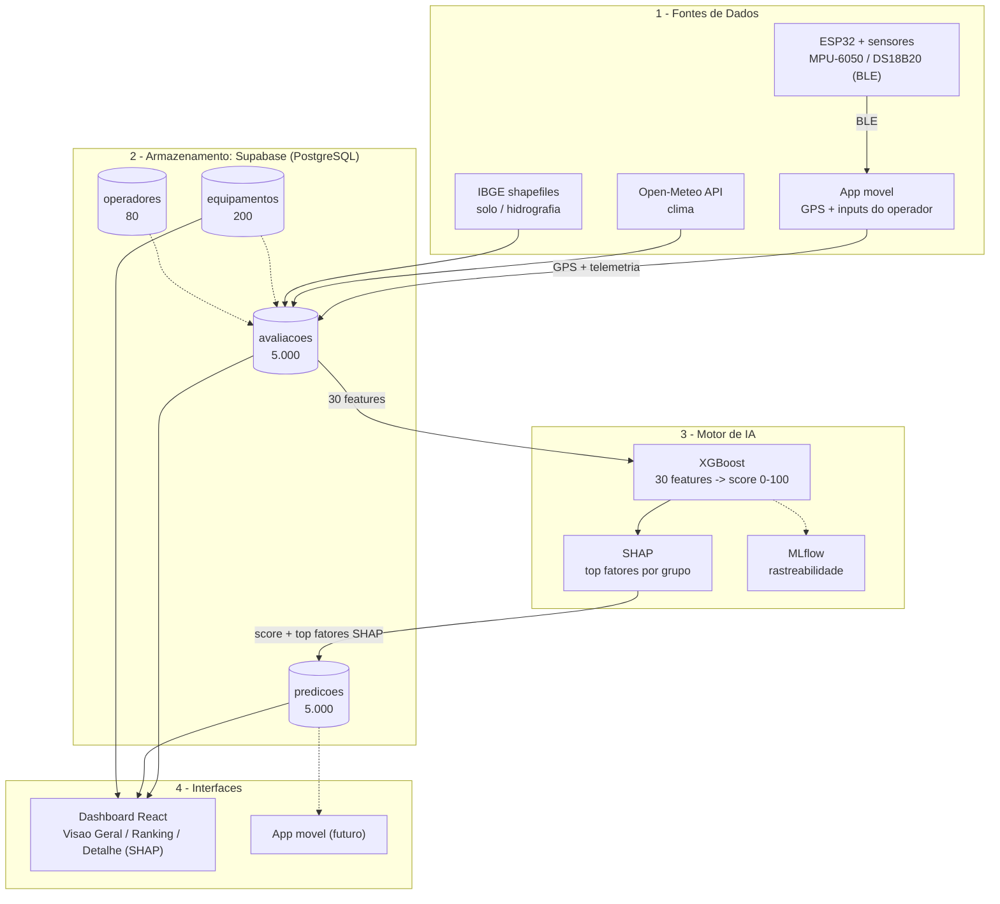

# Plataforma de Análise Preditiva de Riscos para Equipamentos Agrícolas

> **Challenge FIAP + Sompo Seguros**
> Sprint 2 — Modelo, Explicabilidade e Dados

---

## Sumário

0. [Como Rodar o Projeto](#-como-rodar-o-projeto)
1. [Descrição do Problema](#1-descrição-do-problema)
2. [Solução Proposta](#2-solução-proposta)
3. [Personas e Necessidades](#3-personas-e-necessidades)
4. [Estruturação dos Dados](#4-estruturação-dos-dados)
5. [Arquitetura da Solução](#5-arquitetura-da-solução)
6. [Modelo Preditivo](#6-modelo-preditivo)
7. [Planejamento das Próximas Etapas](#7-planejamento-das-próximas-etapas)
8. [Vídeo de Apresentação](#8-vídeo-de-apresentação)
9. [Equipe](#9-equipe)

---

## Como rodar o projeto

### Pré-requisitos

**Python 3.13.** Não use 3.14 — `xgboost`, `shap` e `numpy` ainda não publicam wheels para
essa versão e a instalação falha ou tenta compilar do zero.

**macOS — `libomp` (OpenMP).** O XGBoost depende do runtime OpenMP, que **não** vem pelo
`pip`. Sem ele, `import xgboost` falha com `libxgboost.dylib could not be loaded`:

```bash
brew install libomp
```

Linux e Windows já trazem o runtime equivalente (`libgomp` / `vcomp140`) e não precisam
deste passo.

### Primeira vez (setup completo)

```bash
# 1. Clonar o repositório
git clone https://github.com/Avila237/sompo.git
cd sompo

# 2. Criar ambiente virtual (Python 3.13)
python3.13 -m venv .venv

# 3. Ativar ambiente virtual
# Windows:
.venv\Scripts\activate
# Mac/Linux:
source .venv/bin/activate

# 4. Instalar dependências
pip install -r backend/requirements.txt

# 5. Gerar o dataset
python scripts/generate_dataset.py

# 6. Treinar o modelo (gera models/*.joblib, exigidos pelos testes)
python backend/ml/train.py

# 7. Rodar os testes
pytest tests/ -v

# 8. Abrir o notebook de EDA (opcional)
jupyter notebook
# Navegar até notebooks/01_eda.ipynb
```

### Rodar o dashboard (visão Sompo)

Em outro terminal:

```bash
# Rodar o dashboard (em outro terminal)
cd dashboard
npm install
npm run dev
# Abrir http://localhost:5175
```

O dashboard precisa de credenciais do Supabase em `dashboard/.env.local` (use o `.env.example` como base): `VITE_SUPABASE_URL` e `VITE_SUPABASE_KEY`.

### Atualizando (repositório já clonado)

```bash
git pull
.venv\Scripts\activate
python scripts/generate_dataset.py
pytest tests/ -v
```

---

## 1. Descrição do Problema

O setor agrícola brasileiro opera com equipamentos de alto valor — colheitadeiras, tratores e implementos — expostos diariamente a riscos operacionais e ambientais como colisões com obstáculos no solo, tombamentos, atolamento por instabilidade do terreno, operação em proximidade de corpos d'água e danos durante o transporte entre propriedades.

Hoje, a gestão desses riscos é predominantemente reativa: o sinistro ocorre, gera custos elevados (reparo, indisponibilidade, perda total) e só então medidas corretivas são tomadas. A Sompo, que ocupa a 3ª posição no mercado brasileiro de seguros de máquinas e implementos agrícolas, enfrenta esse cenário diretamente — seus produtos Benfeitorias e Penhor Rural cobrem desde incêndio e furto até colisão de colheitadeiras e operação próxima de água.

O problema central é a **baixa previsibilidade desses eventos**. Faltam sistemas que correlacionem fatores ambientais (clima, tipo de solo, precipitação, proximidade de rios) com fatores operacionais (tipo de operação, velocidade, horário, histórico do equipamento) para antecipar situações de risco antes que o dano aconteça.

Os impactos diretos incluem: alto custo de sinistros para a seguradora, perdas financeiras e de produtividade para o produtor rural, e riscos à segurança dos operadores em campo.

---

## 2. Solução Proposta

A solução proposta é uma **plataforma de análise preditiva de riscos para equipamentos agrícolas**, composta por um aplicativo móvel como interface principal, um backend inteligente com modelo de machine learning e, opcionalmente, um dispositivo IoT embarcado (ESP32) para coleta de dados telemétricos em tempo real.

O sistema cruza dados ambientais (clima, precipitação, tipo de solo, proximidade de corpos d'água), operacionais (tipo de operação, vibração, temperatura, velocidade, histórico de uso) e geográficos (localização, relevo, hidrografia via shapefiles do IBGE) para gerar um **score de risco por equipamento e contexto operacional**.

A partir desse score, a plataforma entrega três tipos de saída:

- **Alertas preventivos** em tempo de decisão (antes ou durante a operação)
- **Recomendações práticas** de mitigação (ajuste de rota, adiamento, redução de velocidade)
- **Relatórios explicáveis** com os principais fatores que contribuem para o risco, utilizando SHAP para garantir transparência e auditabilidade

A arquitetura é **mobile-first** — o app funciona como ponto central de coleta (GPS, inputs do operador) e entrega (alertas, dashboard). O dispositivo IoT com ESP32 é um complemento opcional para equipamentos modernos, adicionando sensores de vibração (acelerômetro + giroscópio MPU-6050 GY-521) e temperatura (DS18B20) via Bluetooth Low Energy. Essa decisão garante **cobertura universal**: qualquer equipamento, inclusive máquinas mais antigas sem porta OBD, pode ser monitorado apenas com o celular do operador.

O valor entregue é a transformação de decisões reativas em ações preventivas, reduzindo frequência e severidade de sinistros para a Sompo e custos operacionais para o produtor rural.

A plataforma foi projetada para evoluir de uma solução de scoring ambiental e operacional para um ecossistema completo de gestão de risco: com perfil comportamental do operador incorporado ao modelo, manutenção preventiva comparada com os intervalos recomendados pelo fabricante, explicações contextuais geradas a partir de uma base de conhecimento técnico simulada (RAG), e Usage-Based Insurance para precificação dinâmica baseada em risco histórico real.

---

## 3. Personas e Necessidades

A solução atende três perspectivas principais, desdobradas em perfis específicos:

### 3.1 Sompo (Seguradora)

A Sompo precisa identificar e quantificar fatores que elevam a probabilidade de sinistros, gerar scores de risco por equipamento/região/tipo de operação para apoiar subscrição e precificação, e manter trilha de auditoria sobre os dados e modelos utilizados. As áreas internas beneficiadas incluem:

- **Subscrição:** score explicável para decisões técnicas e recomendações ao cliente.
- **Sinistros:** contexto ambiental e operacional do evento para triagem e aprendizado preventivo.
- **Gestão de risco:** visão agregada para orientar prevenção e reduzir frequência de sinistros.

### 3.2 Cliente Segurado (Produtor Rural / Empresa Agrícola)

O produtor rural ou gestor da operação agrícola precisa de um painel simples de risco por equipamento e operação, alertas antes de operações críticas, recomendações práticas sobre o que mudar (rota, horário, velocidade) e relatórios por fazenda/região/período que comprovem evolução e justifiquem investimentos em segurança. Precisa também poder configurar políticas internas, como definir quando apenas alertar e quando bloquear uma operação.

### 3.3 Usuário Final (por perfil operacional)

- **Operador de equipamento:** precisa de alertas diretos e objetivos no celular — risco de colisão, solo instável, proximidade de água — para ajustar a condução em tempo real.
- **Gestor de frota:** precisa de ranking de risco por equipamento e área, visão comparativa entre modos de uso (campo vs. transporte) e configuração de políticas de alerta.
- **Técnico de manutenção:** precisa identificar padrões operacionais que antecedem danos para atuar preventivamente e reduzir indisponibilidade.
- **Corretor(a):** precisa de explicação objetiva dos fatores de risco e ações preventivas sugeridas para orientar o cliente.

---

## 4. Estruturação dos Dados

A solução integra dados de quatro categorias principais:

### 4.1 Variáveis

**Dados Ambientais** *(fonte: Open-Meteo API)*

| Variável | Tipo | Descrição |
|---|---|---|
| `temperatura_ar` | °C | Temperatura ambiente no momento da operação |
| `precipitacao_mm` | mm | Volume de chuva acumulado nas últimas 24h |
| `umidade_solo` | % | Estimativa de umidade do solo (precipitação recente + tipo de solo) |
| `velocidade_vento` | km/h | Intensidade do vento na região |
| `condicao_clima` | categórico | Ensolarado, nublado, chuvoso, tempestade |

**Dados Geográficos** *(fonte: IBGE Shapefiles + GPS do app)*

| Variável | Tipo | Descrição |
|---|---|---|
| `latitude` | float | Posição do equipamento |
| `longitude` | float | Posição do equipamento |
| `tipo_solo` | categórico | Arenoso, argiloso, misto (derivado da região) |
| `distancia_agua_m` | metros | Distância até o corpo d'água mais próximo |
| `declividade` | % | Inclinação do terreno na posição atual |

**Dados Operacionais** *(fonte: app móvel + IoT opcional)*

| Variável | Tipo | Descrição |
|---|---|---|
| `tipo_operacao` | categórico | Colheita, plantio, pulverização, transporte, parado |
| `velocidade_kmh` | km/h | Velocidade de deslocamento do equipamento |
| `vibracao_g` | g | Nível de vibração (acelerômetro IoT ou celular) |
| `temperatura_motor` | °C | Temperatura próxima ao motor (sensor DS18B20 via IoT) |
| `horas_operacao` | horas | Horas acumuladas de operação contínua na sessão |
| `horario_operacao` | hora | Hora do dia (operações noturnas = risco elevado) |

**Dados do Equipamento** *(fonte: cadastro no app)*

| Variável | Tipo | Descrição |
|---|---|---|
| `tipo_equipamento` | categórico | Colheitadeira, trator, implemento |
| `idade_equipamento` | anos | Tempo desde fabricação |
| `historico_sinistros` | int | Quantidade de sinistros anteriores registrados |
| `tem_iot` | booleano | Se possui dispositivo IoT acoplado |

**Dados do Operador** *(fonte: app + histórico calculado)*

| Variável | Tipo | Descrição |
|---|---|---|
| `operador_id` | str | Identificador do operador (OP-0001 a OP-0080) |
| `pct_velocidade_acima_recomendada` | % | % do tempo acima da velocidade recomendada |
| `freq_eventos_bruscos` | /hora | Eventos de aceleração/frenagem brusca por hora |
| `pct_operacoes_noturnas` | % | Proporção histórica de operações noturnas |
| `score_operador_historico` | 0–100 | Média móvel do score do operador (30 dias) |

**Dados de Manutenção** *(fonte: app + base de conhecimento)*

| Variável | Tipo | Descrição |
|---|---|---|
| `ultima_manutencao_dias` | int | Dias desde a última manutenção declarada |
| `ultima_manutencao_horas_op` | float | Horas de operação desde última manutenção |
| `atraso_manutencao_pct` | 0.0–3.0 | 1.0 = no limite, 1.5 = 50% atrasado |
| `manutencao_atrasada` | bool | Calculado: ultrapassou algum dos limites |

**Variável Alvo**

| Variável | Tipo | Descrição |
|---|---|---|
| `risco_score` | 0–100 | Score contínuo de risco calculado pelo modelo |
| `faixa_risco` | categórico | Baixo (0–33), médio (34–66), alto (67–100) |

### 4.2 Dataset Simulado (exemplo)

| equipamento_id | tipo_equip | tipo_operacao | precip_mm | umid_solo | dist_agua_m | tipo_solo | vel_kmh | vibr_g | temp_motor | horas_op | horario | idade | hist_sin | operador_id | atraso_manut | score | faixa |
|---|---|---|---|---|---|---|---|---|---|---|---|---|---|---|---|---|---|
| EQ-001 | colheitadeira | colheita | 42 | 78 | 120 | argiloso | 6.2 | 1.8 | 92 | 7.5 | 14:30 | 5 | 2 | OP-012 | 1.4 | 74 | alto |
| EQ-002 | trator | transporte | 3 | 25 | 2800 | arenoso | 28 | 0.6 | 68 | 2.0 | 09:15 | 2 | 0 | OP-034 | 0.6 | 18 | baixo |
| EQ-003 | colheitadeira | colheita | 18 | 55 | 450 | misto | 5.1 | 1.2 | 85 | 5.0 | 17:45 | 8 | 1 | OP-012 | 0.9 | 52 | médio |
| EQ-004 | trator | pulverização | 0 | 15 | 3500 | arenoso | 12 | 0.4 | 71 | 3.0 | 10:00 | 1 | 0 | OP-067 | 0.7 | 11 | baixo |
| EQ-005 | implemento | transporte | 35 | 70 | 80 | argiloso | 32 | 2.1 | — | 1.5 | 22:00 | 12 | 3 | OP-021 | 1.8 | 88 | alto |

> **Leitura do exemplo EQ-005:** o risco alto se justifica pela combinação de chuva recente significativa (35mm), solo argiloso com alta umidade (70%), proximidade de água (80m), alta velocidade em transporte (32 km/h), vibração elevada, equipamento antigo com histórico de sinistros e operação noturna.

Para o desenvolvimento e validação do modelo, foi gerado um dataset simulado com **5.000 registros** e **37 colunas**, cobrindo variações realistas de todas as variáveis e distribuição balanceada entre as faixas de risco.

---

## 5. Arquitetura da Solução

A arquitetura é organizada em cinco camadas:

### 5.1 Camada 1 — Fontes de Dados

Os dados entram no sistema por três vias: o **aplicativo móvel** (GPS, inputs do operador, acelerômetro do celular), o **dispositivo IoT ESP32** (acelerômetro + giroscópio MPU-6050 GY-521, sensor de temperatura DS18B20, conexão OBD-II via ELM327) e **APIs externas** (Open-Meteo para clima, IBGE shapefiles para dados geográficos e hidrográficos).

### 5.2 Camada 2 — Ingestão e Processamento

O app móvel recebe dados do IoT via Bluetooth Low Energy e os transmite junto com seus próprios dados para o backend. O backend em **FastAPI** é responsável por receber, validar e enriquecer os dados — por exemplo, cruzando a posição GPS com shapefiles do IBGE para calcular distância até corpos d'água e tipo de solo, e consultando a Open-Meteo para obter condições climáticas atuais da coordenada.

### 5.3 Camada 3 — Motor de IA e Scoring de Risco

O modelo **XGBoost** recebe as features processadas e gera o score de risco (0–100). O **SHAP** é aplicado sobre a predição para extrair os fatores que mais contribuíram para aquele score específico, garantindo explicabilidade por grupo de features (ambiental, operador, manutenção). O **MLflow** registra cada execução do modelo (versão, parâmetros, métricas, dados de entrada) para manter trilha de auditoria. O modelo é treinado offline com dados históricos simulados e serve predições em tempo real via API. O componente de **RAG** (LlamaIndex/LangChain + LLM) usa os top fatores SHAP para buscar trechos da base de conhecimento técnico simulada e gerar recomendações em linguagem natural (endpoint /explain).

### 5.4 Camada 4 — API e Serviços

O FastAPI expõe endpoints REST para: submissão de dados e obtenção do score de risco, consulta de alertas ativos por equipamento, histórico de scores e eventos, e geração de relatórios por fazenda/região/período. A autenticação é feita via **JWT** com controle de acesso por perfil (operador, gestor, analista Sompo).

### 5.5 Camada 5 — Interfaces

- **App móvel (React Native ou Flutter):** interface principal para operadores e gestores — exibe alertas em tempo real, score de risco, recomendações e histórico. Funciona como hub de coleta e entrega de informação.
- **Dashboard web (React):** interface analítica para a Sompo — visão agregada de risco por região, ranking de equipamentos, tendências, relatórios com explicabilidade SHAP e trilha de auditoria. Futuramente incluirá **simulador de cenários** e painel de **Usage-Based Insurance** com índice de risco histórico por equipamento/operador.

**Dashboard implementado (Sprint 2):** o dashboard da visão Sompo já está funcional com **dados reais do Supabase**. São **3 telas integradas**:

- **Visão Geral** — KPIs (200 equipamentos, 5.000 avaliações, score médio, risco alto) e gráficos a partir dos dados reais
- **Ranking de equipamentos** — tabela dos 200 equipamentos com filtros e busca sobre dados reais
- **Detalhe do equipamento** — decomposição SHAP por grupo, top fatores, manutenção e histórico de score

Outras **5 telas** (Simulador, UBI, Relatórios, Corretor, Técnico) já têm o design visual pronto e exibem um overlay **"Em breve"** até serem integradas. Stack: **React 19 + TypeScript + Vite + Tailwind CSS v4**. Para rodar: `cd dashboard && npm run dev`.

### 5.6 Diagrama de Fluxo

Pipeline completo de dados, das fontes até o dashboard (4 camadas):



> **Representação textual alternativa do mesmo fluxo:**

```
Sensores IoT (ESP32) ──BLE──▶ App Móvel ──HTTP──▶ FastAPI ──▶ Enriquecimento
        GPS do celular ─────────┘                              (Open-Meteo + IBGE)
                                                                      │
                                                                      ▼
                                                               XGBoost + SHAP
                                                                      │
                                                                      ▼
                                                              Score + Alertas
                                                                      │
                                                        ┌─────────────┼─────────────┐
                                                        ▼                           ▼
                                                   App Móvel                  Dashboard React
                                                (operador/gestor)            (Sompo/analistas)
```

### 5.7 Stack Tecnológica

| Componente | Tecnologia |
|---|---|
| Firmware IoT | ESP32 (DOIT DevKit) — C++ / Arduino IDE |
| Sensores | MPU-6050 GY-521 (acelerômetro + giroscópio), DS18B20 (temperatura), LM2596 (regulador) |
| OBD-II | ELM327 Bluetooth |
| App Móvel | React Native ou Flutter |
| Backend / API | FastAPI (Python) |
| Modelo de ML | XGBoost + SHAP |
| Rastreabilidade ML | MLflow |
| Dados externos | Open-Meteo (clima), IBGE (shapefiles geográficos) |
| Dashboard | React 19 + TypeScript + Vite + Tailwind CSS v4 |
| Banco de dados | Supabase (PostgreSQL) |
| Deploy | Vercel, Railway ou Render |

---

## 6. Modelo Preditivo

### 6.1 Abordagem

O modelo utiliza **XGBoost para regressão**, gerando um score contínuo de risco de 0 a 100 por equipamento e contexto operacional. A partir desse score, são derivadas três faixas categóricas (baixo, médio, alto) que determinam o tipo de resposta do sistema — informativo, alerta ou recomendação de ação.

### 6.2 Justificativa do XGBoost

O XGBoost foi escolhido por três razões principais. Primeiro, lida bem com variáveis mistas (numéricas e categóricas) e dados tabulares, que é exatamente o formato do dataset do projeto. Segundo, é robusto a valores faltantes — importante porque equipamentos sem IoT terão campos como `vibracao_g` e `temperatura_motor` ausentes. Terceiro, tem excelente relação entre desempenho preditivo e custo computacional, viabilizando inferência rápida em uma API com recursos limitados (Railway/Render).

### 6.3 Entradas e Saídas

**Entradas:** features ambientais, geográficas, operacionais, do equipamento, do **operador** (perfil comportamental histórico) e de **manutenção** (atraso em relação ao intervalo recomendado) — detalhadas na [seção 4](#4-estruturação-dos-dados). Total: **30 features de entrada** (das 37 colunas do dataset, excluídas IDs, timestamp e targets).

**Saídas:** score de risco (0–100), faixa de risco (baixo/médio/alto), top 3 fatores contribuintes (via SHAP) e recomendação de ação.

**Desempenho atual** (test set de 1.000 registros, 20% do dataset — valores em [`models/metrics.json`](models/metrics.json)):

| Métrica | Valor | Leitura |
|---|---|---|
| MAE | 4.72 | Erro médio de ~5 pontos no score de 0–100 |
| RMSE | 6.08 | Penaliza os desvios grandes; próximo do MAE indica poucos outliers |
| R² | 0.9466 | O modelo explica ~95% da variância do score |
| Acurácia por faixa | 88.3% | Acerto na classificação baixo / médio / alto |

Treino: 4.000 registros · 30 features de entrada.

### 6.4 Explicabilidade com SHAP

O SHAP (SHapley Additive exPlanations) é aplicado sobre cada predição individual para decompor o score nos fatores que o geraram. Isso atende diretamente às user stories da Sompo, que exigem resultados explicáveis para sustentar conversas técnicas com clientes e áreas internas, e trilha de auditoria para governança do uso de IA. A decomposição por grupo (ambiental, geográfico, operacional, equipamento, operador, manutenção) permite exibir "dos 74 pontos, 45 vêm do ambiente, 18 do operador e 11 da manutenção".

**Importância global das features.** Cada ponto é um registro do test set; a posição no eixo X é o quanto aquela feature empurrou o score daquele registro para cima (direita) ou para baixo (esquerda). O driver dominante é `historico_sinistros` (mean |SHAP| = 18.58), seguido por horas de operação e distância do corpo d'água.

<p align="center">
  
</p>

**Decomposição de uma predição individual.** O mesmo mecanismo aplicado a um único equipamento classificado como risco alto: partindo da média do dataset (E[f(X)] = 47.6), o histórico de sinistros sozinho adiciona +41.5 pontos, levando o score final a 87.3. É essa cadeia que o endpoint `/explain` devolve ao usuário — não apenas o número.

<p align="center">
  
</p>

### 6.5 Exemplo de Saída

```json
{
  "equipamento_id": "EQ-001",
  "risco_score": 74,
  "faixa_risco": "alto",
  "contribuicao_ambiental": 45,
  "contribuicao_operador": 18,
  "contribuicao_manutencao": 11,
  "fatores_principais": [
    {"fator": "precipitacao_mm", "valor": 42, "contribuicao": "+18"},
    {"fator": "distancia_agua_m", "valor": 120, "contribuicao": "+15"},
    {"fator": "atraso_manutencao_pct", "valor": 1.4, "contribuicao": "+12"}
  ],
  "recomendacao": "Solo argiloso com alta umidade após chuva significativa. Manutenção 40% atrasada. Recomenda-se avaliar adiamento da operação.",
  "modelo_versao": "v0.1.0",
  "timestamp": "2026-04-06T14:30:00Z"
}
```

### 6.6 Rastreabilidade com MLflow

Cada treinamento e cada versão do modelo são registrados no MLflow com: parâmetros (hiperparâmetros do XGBoost), métricas (RMSE, MAE, distribuição de erros por faixa), artefatos (modelo serializado, gráficos SHAP globais) e dataset utilizado. Isso permite auditoria completa e rollback para versões anteriores se necessário.

### 6.7 Explicação Contextual (RAG)

Os top fatores SHAP de cada predição são usados para buscar trechos relevantes em uma base de conhecimento técnico simulada (manuais de operação e manutenção por tipo de equipamento, em formato Markdown). Um LLM sintetiza esses trechos em uma recomendação em linguagem natural, acessível via endpoint /explain da API. A implementação usa LlamaIndex ou LangChain e é construída **após** o treinamento do XGBoost.

### 6.8 Evolução Futura

Na fase de protótipo, o modelo será treinado com dados simulados (~5.000 registros). Conforme dados reais forem coletados via app e IoT, o modelo poderá ser retreinado incrementalmente. A arquitetura também permite substituir ou complementar o XGBoost com outros modelos (LightGBM, redes neurais) sem alterar a interface da API.

---

## 7. Planejamento das Próximas Etapas

### Sprint 1 — Fundação e Dados ✅ CONCLUÍDA

- Documentação e estrutura do repositório
- Dataset v1, EDA inicial e primeira suíte de testes

### Sprint 2 — Modelo, Explicabilidade e Dados (entrega: 04/06/2026)

**Concluído:**
- Dataset expandido para 37 colunas (operador, manutenção, metadados RAG)
- Modelo XGBoost treinado e validado (MAE 4.72, R² 0.9466, acurácia faixas 88.3%)
- SHAP para explicabilidade por grupo de features (6 grupos)
- MLflow para rastreabilidade (experimento `safefield-xgboost`)
- Notebooks documentados: EDA v2 (`01_eda.ipynb`) + pipeline de treinamento (`02_treinamento.ipynb`)
- Supabase (PostgreSQL): 4 tabelas com dados completos (equipamentos, operadores, avaliacoes, predicoes)
- Predições com top 5 fatores SHAP em JSONB + versão do modelo
- 251 testes automatizados passando (test_dataset 70, test_generate_dataset 63, test_model 26, test_shap 38, test_mlflow 25, test_supabase 18, test_predicoes 11)
- Dashboard React (visão Sompo): 3 telas integradas ao Supabase — Visão Geral (KPIs e gráficos), Ranking de equipamentos (filtros e busca) e Detalhe do equipamento (decomposição SHAP por grupo e histórico)
- Demais telas com overlay "Em breve": Simulador, UBI, Relatórios, Corretor, Técnico
- Diagrama de arquitetura (Mermaid) no README

**Pendente:**
- Vídeo de apresentação (até 5 min)

### Sprint 3 — Backend e API (a definir)

- API FastAPI completa (endpoints de score, alertas, histórico, /explain)
- Implementação do RAG (LlamaIndex/LangChain + LLM)
- Base de conhecimento simulada (Markdowns para RAG)
- Integração Open-Meteo + IBGE shapefiles
- Testes de integração do backend

### Sprint 4 — App Móvel e UBI (a definir)

- App mobile (telas de operador e gestor)
- Integração app ↔ backend (API REST) e app ↔ IoT via BLE
- Dashboard React completo (simulador de cenários + UBI)
- Usage-Based Insurance para precificação dinâmica baseada em risco histórico

**Entrega final: 15/09/2026**

### Divisão de Responsabilidades

| Responsável | Frente Principal |
|---|---|
| Guilherme | Backend (FastAPI), modelo de ML (XGBoost/SHAP), arquitetura geral |
| Kainan | App móvel, integração BLE/IoT, dashboard React |
| Ambos | Documentação, dataset simulado, testes integrados, apresentação |

### Ferramentas de Gestão

O acompanhamento do projeto é feito via **Notion**, com checklist semanal de entregas e status por fase.

---
## 8. Vídeo de Apresentação

🔗 https://youtu.be/lLwrnie-Qmk

---

## 9. Equipe

| Nome | RM |
|---|---|
| Guilherme Avila | 571294 |
| Kainan | 570594 |

---

> **Nota:** Este repositório é privado e foi compartilhado exclusivamente com os tutores conforme orientação do enunciado.
